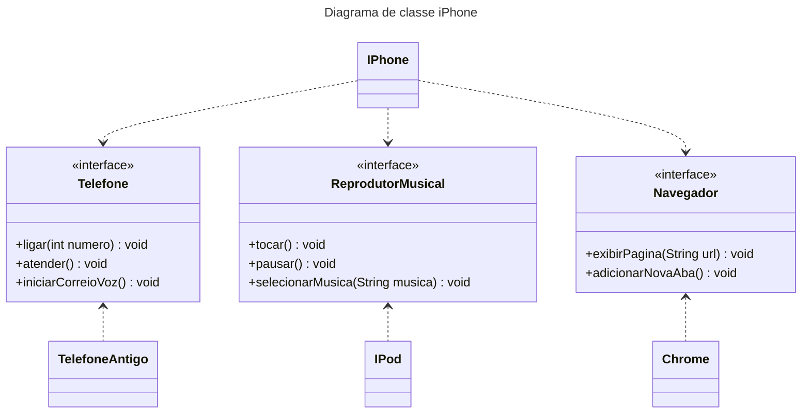

# Desafio POO DIO: Iphone 📱

Bem vindo(a) ao meu repositório! Aqui você encontrará a resolução do desafio de Programação Orientada a Objeto (POO) presente no bootcamp [Desenvolvimento Java com IA](https://web.dio.me/track/coding-future-gft-desenvolvimento-java-com-ia) da DIO.

## Sobre o desafio

O desafio consistiu em criar um diagrama de classe de um iPhone, tendo como base o [lançamento do iPhone em 2007](https://www.youtube.com/watch?v=9ou608QQRq8). O foco principal é representar as funcionalidades que foram implementadas no dispositivo de forma gráfica no diagrama, sendo elas:

- Telefone
- Reprodutor musical (mídias em geral)
- Navegador de internet

Além disso, como um extra, eu implementei o diagrama na prática utilizando a linguagem Java. Para mais informações acesse a [documentação do desafio](https://github.com/digitalinnovationone/trilha-java-basico/blob/main/desafios/poo/README.md).

## Diagrama de classe

