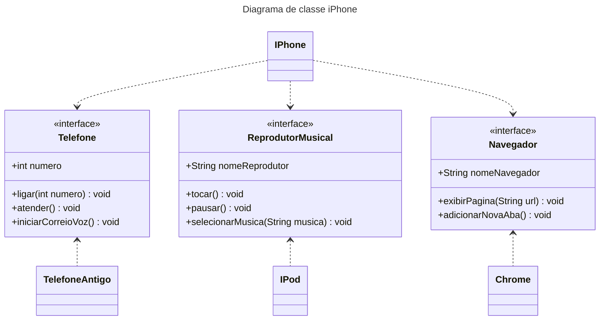

# Diagrama de classe

Para fazer este diagrama foi utilizada a ferramenta [mermaid](https://mermaid.js.org/).

```mermaid
---
title: Diagrama de classe iPhone
---
classDiagram

    class ReprodutorMusical
    <<interface>> ReprodutorMusical
        ReprodutorMusical: +String nomeReprodutor
        ReprodutorMusical: +tocar() void
        ReprodutorMusical: +pausar() void
        ReprodutorMusical: +selecionarMusica(String musica) void
    ReprodutorMusical <.. IPod

    class Telefone
    <<interface>> Telefone
        Telefone: +int numero
        Telefone: +ligar(int numero) void
        Telefone: +atender() void
        Telefone: +iniciarCorreioVoz() void
    Telefone <.. TelefoneAntigo

    class Navegador
    <<interface>> Navegador
        Navegador: +String nomeNavegador
        Navegador: +exibirPagina(String url) void
        Navegador: +adicionarNovaAba() void
    Navegador <.. Chrome

    IPhone ..> Telefone
    IPhone ..> ReprodutorMusical
    IPhone ..> Navegador
```
